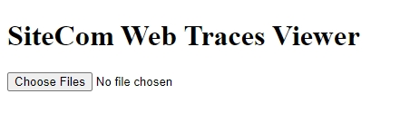

# SiteCom Web Traces Viewer

## Licensing:

#### Table of Contents
1. [Description](#description)
2. [Installation](#installation)
3. [Usage](#usage)
4. [Contributing](#contributing)
5. [Tests](#tests)
6. [Links](#links)
7. [Questions](#questions)

## Description
Upload a svclog trace file, from a SiteCom system, to populate the data into a data grid.

## Installation
nodeJS  
npm install    
npm start

## Usage
1. Download repository.
2. Open PowerShell/Bash, navigate in PowerShell/Bash into the downloaded repository folder.
3. Run "npm install", then "npm start".

## Contributing
This is open source project. Feel free to contribute😊.  

## Tests
Run "npm start" in the PowerShell/Bash.

## Screenshot(s)
  
  

## Links
Live/Production = https://crisc3.github.io/SiteComTraces/  

## Questions
For any questions, you can contact:  
Github = https://github.com/CrisC3  
Email  = Cristobal.Canales@gmail.com